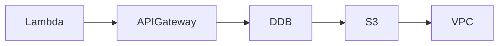

# InfraTales | AWS CDK Serverless Document Pipeline: Private Lambdas Without NAT Gateway

**AWS CDK TYPESCRIPT reference architecture — serverless pillar | advanced level**

> Every team eventually needs to accept documents from external clients — contracts, KYC uploads, compliance files — and the naive approach of dumping files into S3 with a pre-signed URL and hoping a Lambda picks it up breaks the moment you need audit trails, format validation, and access control that satisfies your security team. Building this with proper API authentication, VPC isolation, and event-driven processing without NAT Gateway costs is the part nobody blogs about honestly. This project solves that: a production-grade document ingestion pipeline that keeps Lambdas in private subnets, routes all AWS service traffic through VPC endpoints, and gates every API call behind a custom Lambda authorizer.

[](LICENSE)
[](CONTRIBUTING.md)
[](https://aws.amazon.com/)
[](https://aws.amazon.com/cdk/)
[](https://infratales.com/p/30e5996f-81d1-4c49-a469-31607e45f66b/)
[](https://infratales.com)


## 📋 Table of Contents

- [Overview](#-overview)
- [Architecture](#-architecture)
- [Key Design Decisions](#-key-design-decisions)
- [Getting Started](#-getting-started)
- [Deployment](#-deployment)
- [Docs](#-docs)
- [Full Guide](#-full-guide-on-infratales)
- [License](#-license)

---

## 🎯 Overview

The system composes four CDK stacks — NetworkingStack, StorageStack, ComputeStack, and ApiStack — wired together in a parent TapStack. Documents enter through API Gateway (Interface VPC endpoint), pass a Lambda Authorizer that validates API keys against DynamoDB, land in an encrypted S3 bucket, and immediately trigger a Document Processor Lambda that writes metadata back to DynamoDB with Streams enabled. The non-obvious design choice is zero NAT Gateways: all Lambda-to-AWS-service traffic routes exclusively through S3 and DynamoDB Gateway endpoints plus the API Gateway Interface endpoint, keeping Lambdas in fully isolated private subnets at no per-GB data cost. DynamoDB Streams then fan out to a Notification Lambda for downstream status updates, and a Dead Letter Queue catches any processing failures before they disappear silently. [from-code]

**Pillar:** SERVERLESS — part of the [InfraTales AWS Reference Architecture series](https://infratales.com).
**Target audience:** advanced cloud and DevOps engineers building production AWS infrastructure.

---

## 🏗️ Architecture



> 📐 See [`diagrams/`](diagrams/) for full architecture, sequence, and data flow diagrams.

> Architecture diagrams in [`diagrams/`](diagrams/) show the full service topology (architecture, sequence, and data flow).
> The [`docs/architecture.md`](docs/architecture.md) file covers component responsibilities and data flow.

---

## 🔑 Key Design Decisions

- Zero NAT Gateways saves ~$65-130/month per AZ but means Lambdas cannot reach any non-AWS internet endpoint — third-party virus scanning, webhook callbacks, or external validation APIs all break silently at runtime unless you add Interface endpoints or redesign the flow. [inferred]
- API Gateway Interface VPC endpoint adds ~$16/month per AZ and roughly 1-2ms of latency per call compared to the public endpoint, but it is the only way to keep the API callable from inside the VPC without internet exposure. [inferred]
- A Lambda Authorizer that validates API keys against DynamoDB on every request adds a cold-start-sensitive latency spike of 100-500ms and burns DynamoDB read capacity — authorizer caching (TTL 300s) is the fix, but caching means revoked keys stay valid for up to 5 minutes. [editorial]
- DynamoDB Streams feeding a Notification Lambda creates at-least-once delivery semantics — duplicate processing of status updates is guaranteed under retry conditions, so the Notification Lambda must be idempotent or you will generate duplicate notifications in production. [inferred]
- KMS encryption on CloudWatch Logs requires the KMS key policy to explicitly grant the logs.us-east-1.amazonaws.com service principal access, and this is the single most common deployment failure in setups like this — CDK does not enforce it automatically. [editorial]

> For the full reasoning behind each decision — cost models, alternatives considered, and what breaks at scale — see the **[Full Guide on InfraTales](https://infratales.com/p/30e5996f-81d1-4c49-a469-31607e45f66b/)**.

---

## 🚀 Getting Started

### Prerequisites

```bash
node >= 18
npm >= 9
aws-cdk >= 2.x
AWS CLI configured with appropriate permissions
```

### Install

```bash
git clone https://github.com/InfraTales/<repo-name>.git
cd <repo-name>
npm install
```

### Bootstrap (first time per account/region)

```bash
cdk bootstrap aws://YOUR_ACCOUNT_ID/YOUR_REGION
```

---

## 📦 Deployment

```bash
# Review what will be created
cdk diff --context env=dev

# Deploy to dev
cdk deploy --context env=dev

# Deploy to production (requires broadening approval)
cdk deploy --context env=prod --require-approval broadening
```

> ⚠️ Always run `cdk diff` before deploying to production. Review all IAM and security group changes.

---

## 📂 Docs

| Document | Description |
|---|---|
| [Architecture](docs/architecture.md) | System design, component responsibilities, data flow |
| [Runbook](docs/runbook.md) | Operational runbook for on-call engineers |
| [Cost Model](docs/cost.md) | Cost breakdown by component and environment (₹) |
| [Security](docs/security.md) | Security controls, IAM boundaries, compliance notes |
| [Troubleshooting](docs/troubleshooting.md) | Common issues and fixes |

---

## 📖 Full Guide on InfraTales

This repo contains **sanitized reference code**. The full production guide covers:

- Complete AWS CDK TYPESCRIPT stack walkthrough with annotated code
- Step-by-step deployment sequence with validation checkpoints
- Edge cases and failure modes — what breaks in production and why
- Cost breakdown by component and environment
- Alternatives considered and the exact reasons they were ruled out
- Post-deploy validation checklist

**→ [Read the Full Production Guide on InfraTales](https://infratales.com/p/30e5996f-81d1-4c49-a469-31607e45f66b/)**

---

## 🤝 Contributing

See [CONTRIBUTING.md](CONTRIBUTING.md) for guidelines. Issues and PRs welcome.

## 🔒 Security

See [SECURITY.md](SECURITY.md) for our security policy and how to report vulnerabilities responsibly.

## 📄 License

See [LICENSE](LICENSE) for terms. Source code is provided for reference and learning.

---

<p align="center">
  Built by <a href="https://www.rahulladumor.com">Rahul Ladumor</a> | <a href="https://infratales.com">InfraTales</a> — Production AWS Architecture for Engineers Who Build Real Systems
</p>
